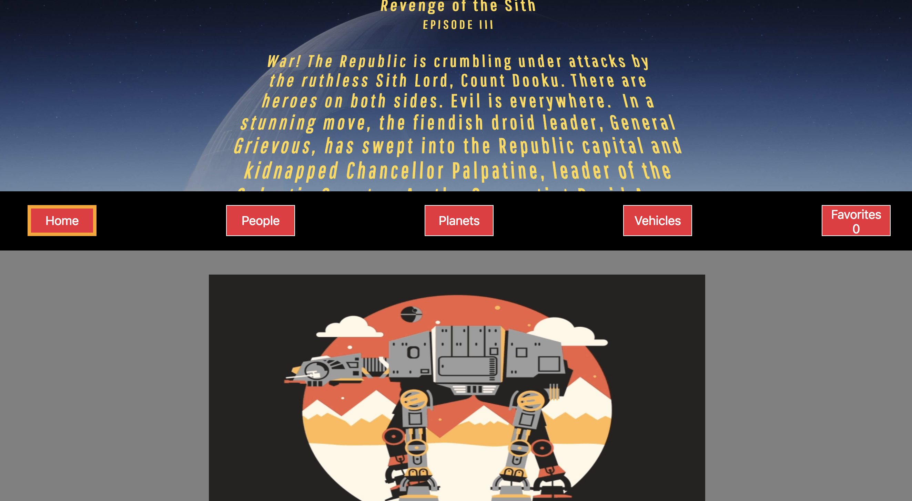

# Swapi-Box

## OverView
This was a week long solo project that had displayed characters, vehicles, and planets from the Star Wars Universe. It was one of my favorite projects, because we had so much creative freedom over the project.

## Areas of Focus
This projects was used with create-react-app, and SCSS. I also dealt with asynchronous API calls to fetch the data that we needed to display on the pages. This project really reinforced our knowledge and skills in React, and ES7 async await.
